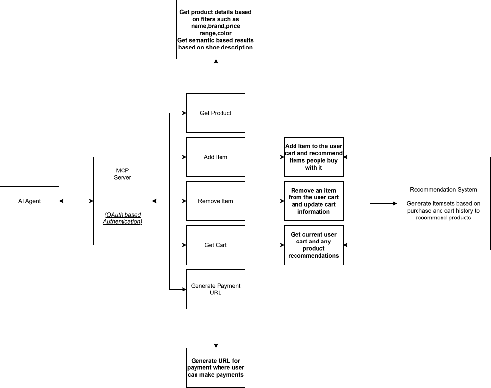
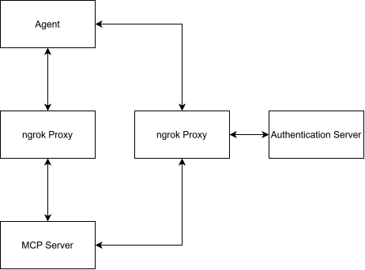

# Butlet MCP 

An OAuth-authenticated MCP server that allows AI agents to interact with a merchant's commerce system through secure, user-scoped tools.

The server allows an AI agent to discover products, filter a merchant's catalog, manage a user-specific shopping cart, and initiate payments through Razorpay.


### Workflow




## Features

### Product Catalog

The agent can:

* Browse merchant products
* Search/filter products
* Inspect product information
* Select products for purchase

### User-Specific Cart

Cart state is associated with the authenticated identity.

The agent can:

* Add products to the cart
* Remove products
* View the current cart
* Maintain cart state across MCP tool calls

The server derives the user context from the authenticated token 

### OAuth Authentication

Authentication is handled through **Keycloak** using OAuth 2.0 / OpenID Connect.

The MCP server validates the access token before allowing protected operations.

Authentication provides the foundation for:

* User identification
* Cart isolation
* Protected commerce operations
* Future authorization scopes/roles

### Payment Integration

The server integrates with **Razorpay** to initiate payments.

The checkout flow can generate a payment link that is returned to the user.

Where the supported payment flow permits it, payment can also be initiated directly through the available payment mechanism.

## MCP Tools


| Tool                  | Description                                 |
| --------------------- | ------------------------------------------- |
| `get_products`       | Retrieve products from the merchant catalog and search/filter products                      |
| `get_cart`            | Retrieve the authenticated user's cart      |
| `add_item`         | Add an item to the user's cart              |
| `remove_item`    | Remove an item from the user's cart         |
| `generate_payment_link` | Generate a checkout link that let user pay via razorpay gateway            |
| `get_recent_order` | Get the latest payment and cart info made by the  user |


## Infrastructure

During development, the locally running MCP server and authentication service are exposed externally using **ngrok reverse tunnels**.

Workflow used in development and testing




## Setup

### 1. Start Keycloak

Configure a Keycloak realm with:

* OAuth/OIDC client
* Valid redirect URIs
* Allowed origins
* Required client scopes
* Appropriate token claims


### 2. Start the Merchant Backend

Start the backend responsible for:

* Product catalog and filtering
* Cart management
* Checkout
* Payment integration

### 3. Start the MCP Server

Run the MCP server locally

The server exposes the MCP endpoint over HTTP locally or deployed over a secured endpoint

### 4. Expose the Server Through HTTPS

For development, expose the MCP endpoint using ngrok or deploy it on a secured endpoint

Use the generated HTTPS endpoint when configuring the MCP client.

### 5. Configure the MCP Client

Configure the MCP client/agent to connect to the public MCP HTTPS endpoint.

The agent then authenticates through the configured OAuth authorization server.

## Environment Variables

```env
QDRANT_API="ey......."
QDRANT_URL="https://...."

MONGO_CONNECTION_URL="mongodb+srv://......."

RAZORPAY_API="rzp_test_......."
RAZORPAY_SECRET="............"

OAUTH_CLIENT_ID="......"
OAUTH_CLIENT_SECRET=".........."

HOST="........"
PORT="..........."

AUTH_HOST="............."
AUTH_PORT="......."
AUTH_REALM="..........."
```

## Project Goals
The project lets an AI Agent interact with a merchant's catalog, manage user carts and generate payment links 